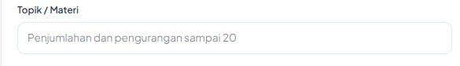
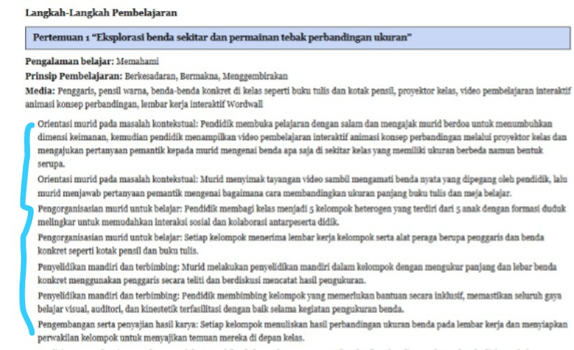
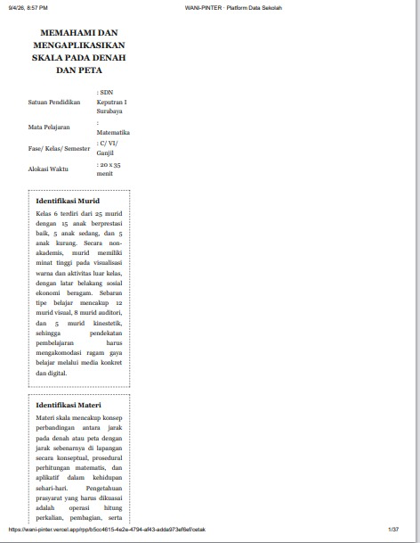

# 📋 Dokumentasi Ulasan Pengguna & Rencana Perbaikan (User Feedback & Action Plan)

**Fitur:** Generator Modul Ajar / RPP  
**Aplikasi:** WANI-PINTER (Platform Data Sekolah)  
**Tanggal:** 15 September 2026  
**Status:** Siap Ditindaklanjuti (*Ready for Sprint*)  

---

## 📌 1. Ringkasan Eksekutif (Executive Summary)

Berdasarkan hasil pengujian dan umpan balik (*user review*) langsung dari guru/pengguna di lapangan, terdapat **5 catatan utama** yang mencakup aspek **UI/UX Input**, **Akurasi Pedagogis**, **Kualitas Bahasa Prompting AI**, serta **Bug Tampilan Cetak (Print View)**.

### Matriks Prioritas Kerja (Action Matrix)

| ID | Kategori | Ringkasan Isu | Solusi Utama | Prioritas |
| :--- | :--- | :--- | :--- | :---: |
| **BUG-01** | Frontend / Print CSS | Tampilan cetak menyempit di sisi kiri saat dialog print browser dibuka | Reset CSS `@media print` agar kontainer memenuhi 100% lebar kertas A4 | **P0 (Kritis)** |
| **FEAT-01** | Tampilan Dokumen / PDF | Langkah kegiatan pembelajaran tidak memiliki penomoran urut | Terapkan *ordered list* (`<ol>` / penomoran sekuensial) di web preview, PDF, dan DOCX | **P1 (Tinggi)** |
| **AI-01** | AI Prompt Engineering | Bahasa langkah pembelajaran kaku, repetitif, dan kurang natural | Update instruksi prompt: subjek aktif (*Murid/Guru*), bahasa mengalir (*human-like*), hapus repetisi sintaks | **P1 (Tinggi)** |
| **AI-02** | Logika Pedagogis | Ketiga prinsip pembelajaran (*Berkesadaran, Bermakna, Menggembirakan*) muncul bersamaan di tiap pertemuan | AI memilih 1–2 prinsip dominan yang paling relevan dengan tipe kegiatan tiap pertemuan | **P2 (Sedang)** |
| **FEAT-02** | UX / Kurikulum Merdeka | Guru memerlukan field input *Tujuan Pembelajaran* di form awal | Tambahkan input *Tujuan Pembelajaran* (opsional/rekomendasi) setelah input *Topik / Materi* | **P2 (Sedang)** |

---

## 🔍 2. Rincian Ulasan, Tangkapan Layar, & Solusi

### 🔹 Item 1: Form Input — Penambahan Field "Tujuan Pembelajaran"


* **Ulasan Asli Pengguna:**
  > *"dek ijin, bagian di awal sebaiknya yang dimasukkan guru adalah tujuan pembelajaran mungkin bisa setelah topik ini, karena yang given dr guru itu Tujuan pembeljarannya"*
* **Kategori:** UI/UX & Flow Kurikulum
* **Analisis Masalah:**
  Dalam administrasi Kurikulum Merdeka, guru sudah memiliki daftar Capaian Pembelajaran (CP) dan Tujuan Pembelajaran (TP) yang baku dari dinas/sekolah. Saat ini form hanya meminta **Topik / Materi**, sehingga AI membuat tujuan pembelajarannya sendiri yang berpotensi berbeda dengan target kurikulum resmi guru.
* **Rekomendasi Tindakan:**
  1. Tambahkan kolom input teks/textarea: **"Tujuan Pembelajaran (TP)"** tepat di bawah field **"Topik / Materi"**.
  2. Berikan label penjelas: *(Opsional / Masukkan jika sudah memiliki TP spesifik)*.
  3. **Logika AI:**
     - Jika guru mengisi TP: AI menjadikan TP tersebut sebagai acuan mutlak dalam menurunkan modul ajar.
     - Jika guru mengosongkan TP: AI secara otomatis menyarankan TP yang relevan berdasarkan topik yang diisi.

---

### 🔹 Item 2: Format Dokumen — Penomoran Langkah Pembelajaran (*Numbering*)


* **Ulasan Asli Pengguna:**
  > *"ini setiap pertemuan langkah-langkahnya apakah bisa diberi nomor (in the pdf)."*
* **Kategori:** Dokumen & Format Tampilan (Web, PDF, DOCX)
* **Analisis Masalah:**
  Pada hasil generate modul ajar, setiap langkah pembelajaran ditampilkan sebagai paragraf blok tanpa nomor urut. Hal ini menyulitkan guru saat membaca cepat (*skimming*) atau ketika membawa modul ajar cetak ke dalam kelas nyata.
* **Rekomendasi Tindakan:**
  1. Bungkus setiap instruksi kegiatan ke dalam daftar berurutan berpenomoran (1, 2, 3, dst.) atau penomoran bertingkat per fase (misal: *A. Pendahuluan*, *B. Inti*, *C. Penutup*).
  2. Pastikan penomoran ini konsisten di halaman review web, tampilan cetak (`/cetak`), maupun ekspor file DOCX.

---

### 🔹 Item 3: Logika Pedagogis — Distribusi Prinsip Pembelajaran per Pertemuan


* **Ulasan Asli Pengguna:**
  > *"disetiap pertemuan tidak mungkin muncul tiga prinsip pembelajaran (berkasadaran, bermakna, menggembirakan)"*
* **Kategori:** Akurasi Metodologi Pedagogis
* **Analisis Masalah:**
  Pada bagian atas detail setiap pertemuan selalu tercantum ketiga prinsip:
  `Prinsip Pembelajaran: Berkesadaran, Bermakna, Menggembirakan`.
  Secara metodologis, sebuah aktivitas belajar biasanya menekankan **1 atau maksimal 2 prinsip utama** (misalnya: saat eksplorasi mandiri lebih fokus ke *Bermakna*, saat *ice breaking* atau gamifikasi fokus ke *Menggembirakan*, dan saat refleksi fokus ke *Berkesadaran*).
* **Rekomendasi Tindakan:**
  1. Sesuaikan System Prompt AI agar menganalisis alur kegiatan pertemuan dan memilih **1–2 prinsip pembelajaran dominan** yang paling merefleksikan kegiatan tersebut.
  2. Hindari *hardcoded* atau penulisan generik ketiga prinsip di setiap pertemuan.

---

### 🔹 Item 4: Prompt AI — Kualitas Bahasa Langkah Pembelajaran yang Mengalir & Berpusat pada Murid
* **Ulasan & Catatan Asli Pengguna:**
  > *"sama bahasa dalam langkah-langkah pembelajaran lebih mengalir. menggunakan murid sebagai subjek.. misalka Murid melakukan analis permasaahan kontekstual yaitu... atau guru menjelaskan cara produksi ..... lebih mengalir dan manusia"*
* **Kategori:** Prompt Engineering & Gaya Penulisan AI
* **Analisis Masalah:**
  Teks hasil AI saat ini terasa mekanis/kaku karena menempelkan nama sintaks di awal kalimat secara berulang-ulang:
  - *Contoh saat ini:*
    - `Orientasi murid pada masalah kontekstual: Pendidik membuka pelajaran...`
    - `Orientasi murid pada masalah kontekstual: Murid menyimak tayangan...`
    - `Pengorganisasian murid untuk belajar: Pendidik membagi kelas...`
* **Rekomendasi Tindakan:**
  1. Hilangkan repetisi penulisan label sintaks di setiap awal kalimat.
  2. Tuliskan kegiatan menggunakan **subjek aktif yang jelas** (*Murid* atau *Guru/Pendidik*).
  3. Terapkan pendekatan *student-centered active learning* dengan gaya narasi mengalir dan manusiawi (*human-like*).

#### Contoh Perbandingan Bahasa (Before vs After):
* ❌ **Sebelum (Kaku & Berulang):**
  > `Orientasi murid pada masalah kontekstual: Pendidik membuka pelajaran dengan salam dan mengajak murid berdoa...`  
  > `Orientasi murid pada masalah kontekstual: Murid menyimak tayangan video sambil mengamati benda nyata yang dipegang oleh pendidik...`
*  **Sesudah (Natural & Berpenomoran):**
  > 1. Guru membuka pembelajaran dengan salam, mengajak murid berdoa bersama, dan menampilkan video pemantik interaktif mengenai konsep perbandingan.
  > 2. Murid menyimak tayangan video sambil mengamati benda nyata di sekeliling kelas, lalu menjawab pertanyaan pemantik mengenai perbedaan ukuran benda tersebut.
  > 3. Guru mengorganisasikan murid ke dalam 5 kelompok heterogen untuk kegiatan investigasi.

---

### 🔹 Item 5: Bug Frontend — Tampilan Cetak Menyempit (*Print Preview Squished*)


* **Ulasan Asli Pengguna:**
  > *"ketika mau cetak tampilannya lngsung menyempit"*
* **Kategori:** Bug Frontend (CSS `@media print`)
* **Analisis Masalah:**
  Ketika pengguna membuka halaman cetak (`/rpp/[id]/cetak`) dan menekan tombol cetak/print preview browser (`Ctrl+P` / `Cmd+P`), konten utama tertekan ke kiri hanya menempati sebagian kecil lebar kertas (~30-40%). Akibatnya, ruang kosong di sebelah kanan terbuang dan jumlah halaman membengkak secara drastis (mencapai 37 halaman).
* **Akar Masalah Teknis:**
  - Kontainer layout memiliki batasan `max-width` (seperti `max-w-md` atau layout grid/flex multi-kolom yang tidak direset pada mode cetak).
  - Tidak adanya aturan CSS `@media print` untuk mereset `width: 100% !important; max-width: none !important; margin: 0 auto;`.
* **Rekomendasi Tindakan:**
  1. Periksa `app/(app)/rpp/[id]/cetak/page.tsx` atau stylesheet cetak terkait.
  2. Pastikan aturan cetak mencakup:
     ```css
     @media print {
       @page {
         size: A4;
         margin: 20mm;
       }
       body, .print-container {
         width: 100% !important;
         max-width: 100% !important;
         margin: 0 !important;
         padding: 0 !important;
       }
     }
     ```

---

## 🚀 3. Rencana Eksekusi (Action Items Checklist)

- [ ] **Sprint Task 1 (CSS / Cetak):** Perbaiki styling halaman `/cetak` agar menggunakan lebar halaman 100% di print preview (`@media print`).
- [ ] **Sprint Task 2 (Format / Output):** Tambahkan penomoran berurutan (numbered list) pada langkah pembelajaran di komponen cetak dan generator DOCX.
- [ ] **Sprint Task 3 (Prompt AI):** Perbarui System Prompt generator modul ajar agar:
  - Menggunakan gaya bahasa naratif aktif (*Murid melakukan... / Guru menjelaskan...*).
  - Memilih 1–2 Prinsip Pembelajaran dominan per pertemuan.
  - Menghilangkan duplikasi penulisan sintaks di tiap kalimat.
- [ ] **Sprint Task 4 (UI Form):** Tambahkan input opsional *Tujuan Pembelajaran* pada formulir pembuatan modul ajar.
